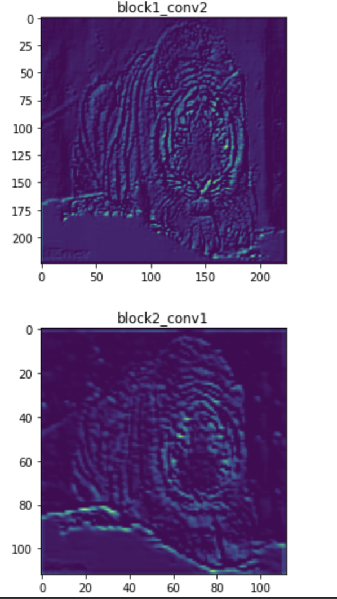

# keras学习笔记

### 写在前面

keras类似深度学习届的sklearn，是一个高度抽象和模块化的tf封装

Sklearn主要适合中小型的机器学习（深度学习）项目，尤其是对一些数据量不大且往往需要使用者手动对数据进行处理，并选择合适模型的项目

tensorflow则适合明确需要使用深度学习，且数据处理需求不高的项目，例如手动选择各类特征。这类项目需要的数据量往往很大，且最终需要的精度更高，一般都需要GPU加速计算。keras适合在采样后的小数据集上快速开发。

```python
# -*- encoding=utf-8 -*-

## sklearn的训练demo
import numpy as np
from sklearn import datasets
from sklearn.pipeline import Pipeline
from sklearn.preprocessing import StandardScaler
from sklearn.svm import LinearSVC

iris = datasets.load_iris()
X = iris["data"][:, (2,3)]
y = (iris["target"] == 2).astype( np.float64 )

svm_clf = Pipeline(( ("scaler", StandardScaler()),
                     ("linear_svc", LinearSVC(C=1, loss="hinge")) ,))

svm_clf.fit( X, y )
svm_clf.predict( [[5.5, 1.7]]
                
>>> [1.]
```

```python
# -*- encoding=utf-8 -*-

## keras模型搭建网络（functional API），基于tf.keras搭建

import numpy as np
import tensorflow as tf

## 预定义基础层
inputs = tf.keras.Input(shape=(784,))
dense1 = tf.keras.layers.Dense(64, activation='relu')
dense2 = tf.keras.layers.Dense(10, activation='relu')

## 定义模型结构
outputs = dense1(inputs)
outputs = dense2(outputs)
model = tf.keras.Model(inputs=inputs, outputs=outputs, name='mnist_model')
model.summary()
"""
Model: "mnist_model"
_________________________________________________________________
Layer (type)                 Output Shape              Param #   
=================================================================
input_1 (InputLayer)         [(None, 784)]             0         
_________________________________________________________________
dense (Dense)                (None, 64)                50240     
_________________________________________________________________
dense_1 (Dense)              (None, 64)                4160      
_________________________________________________________________
dense_2 (Dense)              (None, 10)                650       
=================================================================
Total params: 55,050
Trainable params: 55,050
Non-trainable params: 0
_________________________________________________________________
"""
## 也可以用tf.keras.utils.plot_model(model, 'mnist_model.png')绘图
## 加载数据集
(x_train,y_train), (x_test, y_test) = tf.keras.datasets.mnist.load_data()

## 图片需要预处理下
x_train = x_train.reshape(60000,784).astype("float32")/255
x_test = x_test.reshape(10000,784).astype("float32")/255

## 模型编译
model.compile(loss=tf.keras.losses.SparseCategoricalCrossentropy(from_logits=True), 
              optimizer=tf.keras.optimizers.RMSprop(), 
              metrics=["accuracy"])

## 模型训练 返回一个字典
hist = model.fit(x_train, y_train, batch_size=64, epochs=1, validation_split=0.1, verbose=1)

## 模型评估 eval[0] loss, eval[1] acc
eval = model.evaluate(x_test, y_test, verbose=1)
```

#### 结合使用

可以将sklearn和tf、keras等结合起来使用。sklearn负责基本的数据清洗，keras负责对问题进行小规模的实验，验证想法，tf负责在完整的数据上进行严肃的调参任务。如可以用sklearn中的k-folder交叉验证方法对模型进行评估，寻找最佳参数。

```python
## tf.keras中的Sequential API
def create_model():
  # create model
  model = Sequential()
  model.add(Dense(12,activation='relu'))
  model.add(Dense(8,activation='relu'))
  model.add(Dense(1,activation='sigmoid'))
  model.compile(loss='binary_crossentropy',optimizer='adam',metrics=['accuracy'])
  return model

## 交叉验证
kfold = StratifiedKFold(y=Y,n_folds=10,shuffle=True,random_state=44)
result = cross_val_score(model, X, y, cv=kfold) 
```

### 进阶写法

##### 一个简单的自编码器和解码器实现

写在前面

```python
import tensorflow as tf


encoder_input = tf.keras.Input(shape=(784,), name="img")
x = tf.keras.layers.Reshape((28, 28, 1))(x)
x = tf.keras.layers.Conv2D(16, 3, activation="relu")(x)
x = tf.keras.layers.Conv2D(32, 3, activation="relu")(x)
x = tf.keras.layers.MaxPooling2D(3)(x)
x = tf.keras.layers.Conv2D(32, 3, activation="relu")(x)
x = tf.keras.layers.Conv2D(16, 3, activation="relu")(x)
encoder_output = tf.keras.layers.GlobalMaxPooling2D()(x)

x = tf.keras.layers.Reshape((4, 4, 1))(encoder_output)
x = tf.keras.layers.Conv2DTranspose(16, 3, activation="relu")(x)
x = tf.keras.layers.Conv2DTranspose(32, 3, activation="relu")(x)
x = tf.keras.layers.UpSampling2D(3)(x)
x = tf.keras.layers.Conv2DTranspose(16, 3, activation="relu")(x)
x = tf.keras.layers.Conv2DTranspose(1, 3, activation="relu")(x)
decoder_output = tf.keras.layers.Flatten()(x)

autoencoder = tf.keras.Model(encoder_input, decoder_output, name="autoencoder")
autoencoder.summary()


(x_train,y_train), (x_test, y_test) = tf.keras.datasets.mnist.load_data()

## 图片需要预处理下
x_train = x_train.reshape(60000,784).astype("float32")/255
x_test = x_test.reshape(10000,784).astype("float32")/255

## 模型编译
autoencoder.compile(optimizer=tf.keras.optimizers.RMSprop(),
                    loss=tf.keras.losses.mse,
                    metrics=['MeanSquaredError'])
## 模型训练
autoencoder.fit(x_train,x_train,batch_size=64,epochs=20,validation_split=0.1)
autoencoder.save_weights('mnist_autoencoder.h5')

## 取编码器
encoder = tf.keras.Model(autoencoder.inputs, 
                               autoencoder.layers[9].input, 
                               name='encoder')

## 预测
decoder = autoencoder.predict(x_test)
encoder = encoder.predict(x_test)

## 绘图
import random

i = random.randint(0,len(x_test))

plt.subplot(131)
plt.title('raw')
plt.imshow(x_test[i].reshape((28,28,1)))
plt.subplot(132)
plt.title('encoder')
plt.imshow(x_test[i])
plt.subplot(133)
plt.title('decoder')
plt.imshow(x_test[i].reshape((28,28,1)))

plt.show()
```


##### 万物皆可call

可以像堆叠层一样堆叠模型，且可以复用其模型参数

```python
import tensorflow as tf

## 先定义一个encoder模型
encoder_input = tf.keras.Input(shape=(28, 28, 1), name="original_img")
x = tf.keras.layers.Conv2D(16, 3, activation="relu")(encoder_input)
x = tf.keras.layers.Conv2D(32, 3, activation="relu")(x)
x = tf.keras.layers.MaxPooling2D(3)(x)
x = tf.keras.layers.Conv2D(32, 3, activation="relu")(x)
x = tf.keras.layers.Conv2D(16, 3, activation="relu")(x)
encoder_output = tf.keras.layers.GlobalMaxPooling2D()(x)

encoder = tf.keras.Model(encoder_input, encoder_output, name="encoder")
encoder.summary()

## 再定义一个decoder模型
decoder_input = tf.keras.Input(shape=(16,), name="encoded_img")
x = tf.keras.layers.Reshape((4, 4, 1))(decoder_input)
x = tf.keras.layers.Conv2DTranspose(16, 3, activation="relu")(x)
x = tf.keras.layers.Conv2DTranspose(32, 3, activation="relu")(x)
x = tf.keras.layers.UpSampling2D(3)(x)
x = tf.keras.layers.Conv2DTranspose(16, 3, activation="relu")(x)
decoder_output = tf.keras.layers.Conv2DTranspose(1, 3, activation="relu")(x)

decoder = tf.keras.Model(decoder_input, decoder_output, name="decoder")
decoder.summary()

## 像调用层一样调用模型
autoencoder_input = tf.keras.Input(shape=(28, 28, 1), name="img")
encoded_img = encoder(autoencoder_input)
decoded_img = decoder(encoded_img)
autoencoder = tf.keras.Model(autoencoder_input, decoded_img, name="autoencoder")
autoencoder.summary()
```

采用nested 方式堆叠模型，这在集成学习中很有用

```python
def get_model():
    inputs = keras.Input(shape=(128,))
    outputs = layers.Dense(1)(inputs)
    return keras.Model(inputs, outputs)


model1 = get_model()
model2 = get_model()
model3 = get_model()

inputs = keras.Input(shape=(128,))
y1 = model1(inputs)
y2 = model2(inputs)
y3 = model3(inputs)
outputs = layers.average([y1, y2, y3])
ensemble_model = keras.Model(inputs=inputs, outputs=outputs)
```

##### 多输入多输出（函数式编程特有）

```python
import tensorflow as tf

num_tags = 12  # Number of unique issue tags
num_words = 10000  # Size of vocabulary obtained when preprocessing text data
num_departments = 4  # Number of departments for predictions


title_input = tf.keras.Input(shape=(None,), name="title")  # Variable-length sequence of ints
body_input = tf.keras.Input(shape=(None,), name="body")  # Variable-length sequence of ints
tags_input = tf.keras.Input(shape=(num_tags,), name="tags")  # Binary vectors of size `num_tags`

# Embed each word in the title into a 64-dimensional vector
title_features = tf.keras.layers.Embedding(num_words, 64)(title_input)
# Embed each word in the text into a 64-dimensional vector
body_features = tf.keras.layers.Embedding(num_words, 64)(body_input)

# Reduce sequence of embedded words in the title into a single 128-dimensional vector
title_features = tf.keras.layers.LSTM(128)(title_features)
# Reduce sequence of embedded words in the body into a single 32-dimensional vector
body_features = tf.keras.layers.LSTM(32)(body_features)

# Merge all available features into a single large vector via concatenation
x = tf.keras.layers.concatenate([title_features, body_features, tags_input])

# Stick a logistic regression for priority prediction on top of the features
priority_pred = tf.keras.layers.Dense(1, name="priority")(x)
# Stick a department classifier on top of the features
department_pred = tf.keras.layers.Dense(num_departments, name="department")(x)

# Instantiate an end-to-end model predicting both priority and department
model = tf.keras.Model(
    inputs=[title_input, body_input, tags_input],
    outputs=[priority_pred, department_pred],
)

# compile the model
model.compile(
    optimizer=tf.keras.optimizers.RMSprop(1e-3),
    loss=[
        tf.keras.losses.BinaryCrossentropy(from_logits=True),
        tf.keras.losses.CategoricalCrossentropy(from_logits=True),
    ],
    loss_weights=[1.0, 0.2],
)

# Dummy input data
title_data = np.random.randint(num_words, size=(1280, 10))
body_data = np.random.randint(num_words, size=(1280, 100))
tags_data = np.random.randint(2, size=(1280, num_tags)).astype("float32")

# Dummy target data
priority_targets = np.random.random(size=(1280, 1))
dept_targets = np.random.randint(2, size=(1280, num_departments))

model.fit(
    {"title": title_data, "body": body_data, "tags": tags_data},
    {"priority": priority_targets, "department": dept_targets},
    epochs=2,
    batch_size=32,
)

```


##### 共享连接层

共享层通常用于编码来自相似空间的输入（例如，两个具有相似词汇的不同文本）。它们可以在这些不同的输入之间共享信息，并且可以在更少的数据上训练这种模型。如果在输入之一中看到给定的单词，则将有利于处理通过共享层的所有输入。

```python
# Embedding for 1000 unique words mapped to 128-dimensional vectors
shared_embedding = layers.Embedding(1000, 128)

# Variable-length sequence of integers
text_input_a = keras.Input(shape=(None,), dtype="int32")

# Variable-length sequence of integers
text_input_b = keras.Input(shape=(None,), dtype="int32")

# Reuse the same layer to encode both inputs
encoded_input_a = shared_embedding(text_input_a)
encoded_input_b = shared_embedding(text_input_b)
```

##### 抽取特征层

keras的函数式编程可以访问中间层的激活情况（图中的“节点”）并在其他地方复用——这对于诸如特征提取之类的操作非常有用。

```python
import numpy as np
import tensorflow as tf
import matplotlib.pyplot as plt

vgg19 = tf.keras.applications.VGG19()

features_list = [layer.output for layer in vgg19.layers] ## 获取结构
features_name = [layer.name for layer in vgg19.layers] ## 获取层名

feat_extraction_model = tf.keras.Model(vgg19.inputs, features_list) ## 查看看到任何层的激活情况

tiger = tf.keras.preprocessing.image.load_img('tiger.jpg',target_size=(224,224))
tiger = tf.keras.preprocessing.image.img_to_array(tiger)

features_deep = feat_extraction_model(tiger.reshape((1,224,224,3)))

## 可视化
for feat,name in zip(features_deep,features_name):
    if 'conv' in name:
        plt.title(f'{name}')
        plt.imshow(np.squeeze(feat.numpy()/255)[:,:,1])
        plt.show()
```



##### 自定义结构

虽然keras内置了许多经典的网络结构，但是从头撸一遍还是很必要的（大雾），但是有些新的模型并不能被及时添加进去，不过，官方提供了自定义接口。keras中的所有层都继承自Layer这个类，Layer类包含了状态（即权重）和输入输出的转换方式（对应call方法），其包含两个重要的方法：

​	1.call，定义layer的计算方法

​	2.build，计算权重，当然你也可以在init中定义

你可以像python函数一样调用layer

```python
import tensorflow as tf

class Linear(tf.keras.layers.Layer):
  	def __init__(self, units=32, input_dim=32):
      super(Linear, self).__init__()
      w_init = tf.random_normal_initializer()
      self.w = tf.Variable(initial_value=w_init(shape=(input_dim, units), dtype="float32"), 
                           trainable=True,)
      b_init = tf.zeros_initializer()
			self.b = tf.Variable(initial_value=b_init(shape=(units,), dtype="float32"), 
                           trainable=True,)
      """
      ## 等价写法
      self.w = self.add_weight(shape=(input_dim, units), 
      												 initializer="random_normal", 
      												 trainable=True)
      self.b = self.add_weight(shape=(units,), initializer="zeros", trainable=True)
      """
    
    def call(self, inputs):
      	return tf.matmul(inputs, self.w) + self.b

x = tf.ones((2,2))
linear_layer = Linear(4,2)
y = linear_layer(x)
print(y)
"""
tf.Tensor(
[[ 0.01013444 -0.01070027 -0.01888977  0.05208318]
 [ 0.01013444 -0.01070027 -0.01888977  0.05208318]], shape=(2, 4), dtype=float32)
"""
```

keras中的函数式编程接口很简洁，定义模型的时候就自动检查结构是否合理，且支持可视化，序列化很方便且容易移植，但是其不支持动态的神经网络结构，如Recursive Networks或者Tree RNN。

```python
import tensorflow as tf

inputs = tf.keras.Input(shape=(784,))
x = layers.Dense(64,activation='relu')(inputs)
outputs = tf.keras.layers.Dense(10)(x)
mlp = tf.keras.Model(inputs, outputs)

## 对应的内部版本
class MLP(tf.keras.Model):
  	def __init__(self, **kwargs):
      	super(MLP, self).__init__(**kwargs)
        self.dense1 = tf.keras.layers.Dense(64, activation='relu')
        self.dense2 = tf.keras.layers.Dense(10)
    
    def call(self, inputs):
      	return = self.dense2(self.dense1(inputs))
      
## 初始化模型
mlp = MLP()

## 第一次调用后，模型才会检查结构是否合理
_ = mlp(tf.zeros(1,32))
```

keras中的模型类（Model）和层类（Layer）类似，不过模型类多了model.predict()、model.fit()和model.evaluate()、save()、save_weights()等内置方法。

```python
class ResNet(tf.keras.Model):

    def __init__(self, num_classes=1000):
        super(ResNet, self).__init__()
        self.block_1 = ResNetBlock() ## 自定义的结构
        self.block_2 = ResNetBlock()
        self.global_pool = layers.GlobalAveragePooling2D()
        self.classifier = Dense(num_classes)

    def call(self, inputs):
        x = self.block_1(inputs)
        x = self.block_2(x)
        x = self.global_pool(x)
        return self.classifier(x)


resnet = ResNet()
dataset = ...
resnet.fit(dataset, epochs=10)
resnet.save(filepath)
```

##### 自定义掩码

layer中的masking操作

```python
class CustomEmbedding(keras.layers.Layer):
    def __init__(self, input_dim, output_dim, mask_zero=False, **kwargs):
        super(CustomEmbedding, self).__init__(**kwargs)
        self.input_dim = input_dim
        self.output_dim = output_dim
        self.mask_zero = mask_zero

    def build(self, input_shape):
        self.embeddings = self.add_weight(
            shape=(self.input_dim, self.output_dim),
            initializer="random_normal",
            dtype="float32",
        )

    def call(self, inputs):
        return tf.nn.embedding_lookup(self.embeddings, inputs)

    def compute_mask(self, inputs, mask=None):
        if not self.mask_zero:
            return None
        return tf.not_equal(inputs, 0)


layer = CustomEmbedding(10, 32, mask_zero=True)
x = np.random.random((3, 10)) * 9
x = x.astype("int32")

y = layer(x)
mask = layer.compute_mask(x)
"""
tf.Tensor(
[[ True  True  True  True  True  True  True  True  True  True]
 [ True  True  True  True  True  True  True  True  True  True]
 [ True  True  True  True  True  True  True  True  True  True]], shape=(3, 10), dtype=bool)
"""
```

大多数层没有修改时间维度，因此不需要修改当前掩码。但是，他们可能仍然希望能够将当前的掩码保持不变地传播到下一层。默认情况下，自定义层将破坏当前的掩码（因为框架无法确定传播该蒙版是否安全）。

如果您有一个不修改时间维度的自定义图层，并且希望它能够传播当前输入掩码，则应在图层构造函数中设置self.supports_masking = True。此时，compute_mask()的默认行为是仅通过当前掩码。

```python
class MyActivation(keras.layers.Layer):
    def __init__(self, **kwargs):
        super(MyActivation, self).__init__(**kwargs)
        # Signal that the layer is safe for mask propagation
        self.supports_masking = True

    def call(self, inputs):
        return tf.nn.relu(inputs)
      
      
inputs = keras.Input(shape=(None,), dtype="int32")
x = layers.Embedding(input_dim=5000, output_dim=16, mask_zero=True)(inputs)
x = MyActivation()(x)  # Will pass the mask along
print("Mask found:", x._keras_mask)
outputs = layers.LSTM(32)(x)  # Will receive the mask

model = keras.Model(inputs, outputs)

"""
Mask found: Tensor("embedding_4/NotEqual:0", shape=(None, None), dtype=bool)
"""
```

如果要处理上一层的mask信息，那么需要在call中指定mask信息

```python
class TemporalSoftmax(keras.layers.Layer):
    def call(self, inputs, mask=None):
        broadcast_float_mask = tf.expand_dims(tf.cast(mask, "float32"), -1)
        inputs_exp = tf.exp(inputs) * broadcast_float_mask
        inputs_sum = tf.reduce_sum(inputs * broadcast_float_mask, axis=1, keepdims=True)
        return inputs_exp / inputs_sum


inputs = keras.Input(shape=(None,), dtype="int32")
x = layers.Embedding(input_dim=10, output_dim=32, mask_zero=True)(inputs)
x = layers.Dense(1)(x)
outputs = TemporalSoftmax()(x)

model = keras.Model(inputs, outputs)
y = model(np.random.randint(0, 10, size=(32, 100)), np.random.random((32, 100, 1)))
```

##### 各种风格混合

You can use any subclassed layer or model in the functional API as long as it implements a `call` method that follows one of the following patterns:

- `call(self, inputs, **kwargs)` -- Where `inputs` is a tensor or a nested structure of tensors (e.g. a list of tensors), and where `**kwargs` are non-tensor arguments (non-inputs).
- `call(self, inputs, training=None, **kwargs)` -- Where `training` is a boolean indicating whether the layer should behave in training mode and inference mode.
- `call(self, inputs, mask=None, **kwargs)` -- Where `mask` is a boolean mask tensor (useful for RNNs, for instance).
- `call(self, inputs, training=None, mask=None, **kwargs)` -- Of course, you can have both masking and training-specific behavior at the same time.

Additionally, if you implement the `get_config` method on your custom Layer or model, the functional models you create will still be serializable and cloneable.

```python
from tensorflow import keras
from tensorflow.keras import layers

units = 32
timesteps = 10
input_dim = 5

# Define a Functional model
inputs = keras.Input((None, units))
x = layers.GlobalAveragePooling1D()(inputs)
outputs = layers.Dense(1)(x)
model = keras.Model(inputs, outputs)


class CustomRNN(layers.Layer):
    def __init__(self):
        super(CustomRNN, self).__init__()
        self.units = units
        self.projection_1 = layers.Dense(units=units, activation="tanh")
        self.projection_2 = layers.Dense(units=units, activation="tanh")
        # Our previously-defined Functional model
        self.classifier = model

    def call(self, inputs):
        outputs = []
        state = tf.zeros(shape=(inputs.shape[0], self.units))
        for t in range(inputs.shape[1]):
            x = inputs[:, t, :]
            h = self.projection_1(x)
            y = h + self.projection_2(state)
            state = y
            outputs.append(y)
        features = tf.stack(outputs, axis=1)
        print(features.shape)
        return self.classifier(features)


rnn_model = CustomRNN()
_ = rnn_model(tf.zeros((1, timesteps, input_dim)))
"""
(1,10,32)
"""
```

```python
from tensorflow import keras
from tensorflow.keras import layers

units = 32
timesteps = 10
input_dim = 5
batch_size = 16


class CustomRNN(layers.Layer):
    def __init__(self):
        super(CustomRNN, self).__init__()
        self.units = units
        self.projection_1 = layers.Dense(units=units, activation="tanh")
        self.projection_2 = layers.Dense(units=units, activation="tanh")
        self.classifier = layers.Dense(1)

    def call(self, inputs):
        outputs = []
        state = tf.zeros(shape=(inputs.shape[0], self.units))
        for t in range(inputs.shape[1]):
            x = inputs[:, t, :]
            h = self.projection_1(x)
            y = h + self.projection_2(state)
            state = y
            outputs.append(y)
        features = tf.stack(outputs, axis=1)
        return self.classifier(features)


# Note that you specify a static batch size for the inputs with the `batch_shape`
# arg, because the inner computation of `CustomRNN` requires a static batch size
# (when you create the `state` zeros tensor).
inputs = keras.Input(batch_shape=(batch_size, timesteps, input_dim))
x = layers.Conv1D(32, 3)(inputs)
outputs = CustomRNN()(x)

model = keras.Model(inputs, outputs)

rnn_model = CustomRNN()
_ = rnn_model(tf.zeros((1, 10, 5)))
```

### 训练模型

用model.compile()的方式。model.fit()之前需要指定损失函数、优化器，度量方法（可选）和监视器（可选）。

度量方法可以用一个列表来指定，一个模型可以有多个度量方法。如果模型有多个输入或者输出，那么每一个输入或者输出都可以对应不同的度量方法。

损失函数和优化器可以用字符串（其实是每个类的name参数）来指代。

#### 加载数据

使用tf.keras.utils.Sequence 来快速加载数据

好处是可以使用多进程和支持数据打散操作（当fit()中的shuffle=True时），且内存友好（返回的是一个迭代器），还支持在每个epoch中修改数据集（on_epoch_end）

```python
import tensorflow as tf

## 加载图片数据 ## 得到一个image类
tiger_image = tf.keras.preprocessing.image.load_img(filename,target_size=(224,224))
tiger_array = tf.keras.preprocessing.image.img_to_array(tiger) ## numpy array
```

```python
from skimage.io import imread
from skimage.transform import resize
import numpy as np

# Here, `filenames` is list of path to the images
# and `labels` are the associated labels.

class CIFAR10Sequence(tf.keras.utils.Sequence):
    def __init__(self, filenames, labels, batch_size):
        self.filenames, self.labels = filenames, labels
        self.batch_size = batch_size

    def __len__(self):
        return int(np.ceil(len(self.filenames) / float(self.batch_size)))

    def __getitem__(self, idx):
        batch_x = self.filenames[idx * self.batch_size:(idx + 1) * self.batch_size]
        batch_y = self.labels[idx * self.batch_size:(idx + 1) * self.batch_size]
        return np.array([
            resize(imread(filename), (200, 200))
               for filename in batch_x]), np.array(batch_y)

sequence = CIFAR10Sequence(filenames, labels, batch_size)
```

keras中的预处理函数主要通过tf.keras.layers.experimental.preprocessing实现

首先是预处理层，主要包括TextVectorization和Normalization这两类：

- `TextVectorization` layer: turns raw strings into an encoded representation that can be read by an `Embedding` layer or `Dense` layer.
- `Normalization` layer: performs feature-wise normalize of input features.

其次是结构化预处理层，如structured data preprocessing layers，主要包括下面几类：

- `CategoryEncoding` layer: turns integer categorical features into one-hot, multi-hot, or TF-IDF dense representations.
- `Hashing` layer: performs categorical feature hashing, also known as the "hashing trick".
- `Discretization` layer: turns continuous numerical features into integer categorical features.
- `StringLookup` layer: turns string categorical values into integers indices.
- `IntegerLookup` layer: turns integer categorical values into integers indices.
- `CategoryCrossing` layer: combines categorical features into co-occurrence features. E.g. if you have feature values "a" and "b", it can provide with the combination feature "a and b are present at the same time".

当然还有图像部分的预处理层，列举如下：

- `Resizing` layer: resizes a batch of images to a target size.

	```python
	tf.keras.layers.experimental.preprocessing.Resizing(
	    height, width, interpolation="bilinear", name=None, **kwargs
	)
	```

- `Rescaling` layer: rescales and offsets the values of a batch of image (e.g. go from inputs in the `[0, 255]` range to inputs in the `[0, 1]` range.

	```python
	"""
	For instance:
	To rescale an input in the [0, 255] range to be in the [0, 1] range, you would pass scale=1./255.
	To rescale an input in the [0, 255] range to be in the [-1, 1] range, you would pass scale=1./127.5, offset=-1.
	The rescaling is applied both during training and inference.
	"""
	
	tf.keras.layers.experimental.preprocessing.Rescaling(
	    scale, offset=0.0, name=None, **kwargs
	)
	```

- `CenterCrop` layer: returns a center crop if a batch of images.

	```python
	"""
	Crop the central portion of the images to target height and width.
	Input shape
	4D tensor with shape: (samples, height, width, channels), data_format='channels_last'.
	Output shape
	4D tensor with shape: (samples, target_height, target_width, channels).
	
	If the input height/width is even and the target height/width is odd (or inversely), the input image is left-padded by 1 pixel.
	"""
	
	tf.keras.layers.experimental.preprocessing.CenterCrop(
	    height, width, name=None, **kwargs
	)
	```

- `RandomCrop` layer
- `RandomFlip` layer
- `RandomTranslation` layer
- `RandomRotation` layer
- `RandomZoom` layer
- `RandomHeight` layer
- `RandomWidth` layer

有些预处理层包含adapt()方法，adapt()的状态必须根据训练数据事先生成，adapt方法同时也支持传入字典。

- `TextVectorization`: holds a mapping between string tokens and integer indices
- `Normalization`: holds the mean and standard deviation of the features
- `StringLookup` and `IntegerLookup`: hold a mapping between input values and output indices.
- `CategoryEncoding`: holds an index of input values.
- `Discretization`: holds information about value bucket boundaries.

```python
import numpy as np
import tensorflow as tf
from tensorflow.keras.layers.experimental import preprocessing

data = np.array([[0.1, 0.2, 0.3], [0.8, 0.9, 1.0], [1.5, 1.6, 1.7],])
layer = preprocessing.Normalization()

## 通过adapt()方法将预处理层的状态暴露给训练部分
layer.adapt(data)
normalized_data = layer(data) ## normalized_data 均值为0，方差为1

print("Features mean: %.2f" % (normalized_data.numpy().mean()))
print("Features std: %.2f" % (normalized_data.numpy().std()))

"""
Features mean: 0.00
Features std: 1.00
"""
```

```python
data = [
    "ξεῖν᾽, ἦ τοι μὲν ὄνειροι ἀμήχανοι ἀκριτόμυθοι",
    "γίγνοντ᾽, οὐδέ τι πάντα τελείεται ἀνθρώποισι.",
    "δοιαὶ γάρ τε πύλαι ἀμενηνῶν εἰσὶν ὀνείρων:",
    "αἱ μὲν γὰρ κεράεσσι τετεύχαται, αἱ δ᾽ ἐλέφαντι:",
    "τῶν οἳ μέν κ᾽ ἔλθωσι διὰ πριστοῦ ἐλέφαντος,",
    "οἵ ῥ᾽ ἐλεφαίρονται, ἔπε᾽ ἀκράαντα φέροντες:",
    "οἱ δὲ διὰ ξεστῶν κεράων ἔλθωσι θύραζε,",
    "οἵ ῥ᾽ ἔτυμα κραίνουσι, βροτῶν ὅτε κέν τις ἴδηται.",
]
layer = preprocessing.TextVectorization()
layer.adapt(data)
vectorized_text = layer(data)
print(vectorized_text)

"""
tf.Tensor(
[[37 12 25  5  9 20 21  0  0]
 [51 34 27 33 29 18  0  0  0]
 [49 52 30 31 19 46 10  0  0]
 [ 7  5 50 43 28  7 47 17  0]
 [24 35 39 40  3  6 32 16  0]
 [ 4  2 15 14 22 23  0  0  0]
 [36 48  6 38 42  3 45  0  0]
 [ 4  2 13 41 53  8 44 26 11]], shape=(8, 9), dtype=int64)
"""
```

```python
vocab = ["a", "b", "c", "d"]
data = tf.constant([["a", "c", "d"], ["d", "z", "f"]]) ## 若存在未出现的字符，会给他都设为1
layer = preprocessing.StringLookup(vocabulary=vocab)
vectorized_data = layer(data)
print(vectorized_data)

"""
tf.Tensor(
[[2 4 5]
[5 1 1]], shape=(2,3), dtype=int64)
"""
```

TIPS：

1.将预处理部分放到模型推理之中(相当于单独的layer)，这样的好处是支持直接传入原始图像和文本，有GPU加持的时处理效率更高。

```python
inputs = keras.Input(shape=input_shape)
x = preprocessing_layer(inputs)
outputs = training_model(x)
infernece_model = keras.Model(inputs, outputs)
```

2.数据增强，数据增强模块类似dropout，只在模型训练时才启用。

```python
from tensorflow import keras
from tensorflow.keras import layers
from tensosflow.keras.layers.experimental import preprocessing

# Create a data augmentation stage with horizontal flipping, rotations, zooms
data_augmentation = keras.Sequential(
    [
        preprocessing.RandomFlip("horizontal"),
        preprocessing.RandomRotation(0.1),
        preprocessing.RandomZoom(0.1),
      	preprocessing.Resizing(32,32),
    ]
)

# Create a model that includes the augmentation stage
input_shape = (32, 32, 1)
classes = 10
inputs = keras.Input(shape=input_shape)
# Augment images
x = data_augmentation(inputs)
# Rescale image values to [0, 1]
x = preprocessing.Rescaling(1.0 / 255)(x)
# Add the rest of the model
outputs = keras.applications.ResNet50(
    weights=None, input_shape=input_shape, classes=classes
)(x)
model = keras.Model(inputs, outputs)

## 加载输入数据
(x_train, y_train), (x_test, y_test) = keras.datasets.mnist.load_data()

## 将数据reshape成三维
x_train = x_train.reshape(-1,28,28,1)
x_test = x_test.reshape(-1,28,28,1)

model.compile(optimizer=keras.optimizers.Adam(),
              loss=keras.losses.SparseCategoricalCrossentropy(),metrics=["accuracy"])

model.fit(x_train, y_train, batch_size=64, epochs=50, validation_split=0.1)
```

3.one-hot编码

Note that index 0 is reserved for missing values (which you should specify as the empty string `""`), and index 1 is reserved for out-of-vocabulary values (values that were not seen during `adapt()`). You can configure this by using the `mask_token` and `oov_token` constructor arguments of `StringLookup`.

```python
# Define some toy data
data = tf.constant(["a", "b", "c", "b", "c", "a"])

# Use StringLookup to build an index of the feature values
indexer = preprocessing.StringLookup()
indexer.adapt(data)

# Use CategoryEncoding to encode the integer indices to a one-hot vector
encoder = preprocessing.CategoryEncoding(output_mode="binary")
encoder.adapt(indexer(data))

# Convert new test data (which includes unknown feature values)
test_data = tf.constant(["a", "b", "c", "d", "e", ""])
encoded_data = encoder(indexer(test_data))
print(encoded_data)
```

4.哈希编码

主要用于降维。

```python
# Sample data: 10,000 random integers with values between 0 and 100,000
data = np.random.randint(0, 100000, size=(10000, 1))

# Use the Hashing layer to hash the values to the range [0, 64]
hasher = preprocessing.Hashing(num_bins=64, salt=1337)

# Use the CategoryEncoding layer to one-hot encode the hashed values
encoder = preprocessing.CategoryEncoding(max_tokens=64, output_mode="binary")
encoded_data = encoder(hasher(data))
print(encoded_data.shape)

"""
(10000,64)
"""
```

5.文本编码

tf.keras.layers.experimental.preprocessing.TextVectorization(
    max_tokens=None,
    standardize="lower_and_strip_punctuation",
    split="whitespace",
    ngrams=None,
    output_mode="int",
    output_sequence_length=None,
    pad_to_max_tokens=True,
    **kwargs
)

- **output_mode**: Optional specification for the output of the layer. Values can be "int", "binary", "count" or "tf-idf", configuring the layer as follows:
-  "int": Outputs integer indices, one integer index per split string token. When output == "int", 0 is reserved for masked locations; this reduces the vocab size to max_tokens-2 instead of max_tokens-1 
- "binary": Outputs a single int array per batch, of either vocab_size or max_tokens size, containing 1s in all elements where the token mapped to that index exists at least once in the batch item.
-  "count": As "binary", but the int array contains a count of the number of times the token at that index appeared in the batch item.
-  "tf-idf": As "binary", but the TF-IDF algorithm is applied to find the value in each token slot.

```python
# Define some text data to adapt the layer
data = tf.constant(
    [
        "The Brain is wider than the Sky",
        "For put them side by side",
        "The one the other will contain",
        "With ease and You beside",
    ]
)
# Instantiate TextVectorization with "int" output_mode
text_vectorizer = preprocessing.TextVectorization(output_mode="int")
# Index the vocabulary via `adapt()`
text_vectorizer.adapt(data)

# You can retrieve the vocabulary we indexed via get_vocabulary()
vocab = text_vectorizer.get_vocabulary()
print("Vocabulary:", vocab)

# Create an Embedding + LSTM model
inputs = keras.Input(shape=(1,), dtype="string")
x = text_vectorizer(inputs)
x = layers.Embedding(input_dim=len(vocab), output_dim=64)(x)
outputs = layers.LSTM(1)(x)
model = keras.Model(inputs, outputs)

# Call the model on test data (which includes unknown tokens)
test_data = tf.constant(["The Brain is deeper than the sea"])
test_output = model(test_data)
```

```python
# Define some text data to adapt the layer
data = tf.constant(
    [
        "The Brain is wider than the Sky",
        "For put them side by side",
        "The one the other will contain",
        "With ease and You beside",
    ]
)
# Instantiate TextVectorization with "tf-idf" output_mode
# (multi-hot with TF-IDF weighting) and ngrams=2 (index all bigrams)
text_vectorizer = preprocessing.TextVectorization(output_mode="tf-idf", ngrams=2)
# Index the bigrams and learn the TF-IDF weights via `adapt()`
text_vectorizer.adapt(data)

print(
    "Encoded text:\n",
    text_vectorizer(["The Brain is deeper than the sea"]).numpy(),
    "\n",
)

# Create a Dense model
inputs = keras.Input(shape=(1,), dtype="string")
x = text_vectorizer(inputs)
outputs = layers.Dense(1)(x)
model = keras.Model(inputs, outputs)

# Call the model on test data (which includes unknown tokens)
test_data = tf.constant(["The Brain is deeper than the sea"])
test_output = model(test_data)
print("Model output:", test_output)
```


#### 自定义损失函数

keras提供两种定义损失函数的方式，第一种是计算真实标签和实际标签之间的损失；第二种是关于输入数据和预测数据之间的损失。

```python
import tensorflow as tf

def custom_mean_squared_error(y_true, y_pred):
  	return tf.math.reduce_mean(tf.square(y_true-y_pred))

## model.compile(optimizer=..., loss=custom_mean_squared_error)

class CustomMSE(tf.keras.losses.loss):
  	def __init__(self, regularization_factor=0.1, name="custom_mse"):
      	super().__init__(name=name)
        self.regularization_factor = regularization_factor
        
    def call(self, y_true, y_pred):
      	mse = tf.math.reduce_mean(tf.square(y_true-y_pred))
        reg = tf.math.reduce_mean(tf.square(0.5-y_pred))
        return mse+reg*self.regularization_factor
      
## model.compile(optimizer=..., loss=CustomMSE())
```

自定义度量方法

通过继承tf.keras.metrics.Metric类，可以自定义度量方法，但是修改其中的四个方法：

1.init(self)

2.update_state(self, y_true, y_pred, sample_weight=None):根据y_true和y_pred更新状态

3.result(self):利用状态计算模型的最终结果

4.reset_states(self):重新初始化度量方法

5.add_loss和add_metric是Layer中的属性，用于计算无pred标签数据的损失/度量方法，此时，model.compile中无须写loss=...

```python
class CategoricalTruePositives(keras.metrics.Metric):
    def __init__(self, name="categorical_true_positives", **kwargs):
        super(CategoricalTruePositives, self).__init__(name=name, **kwargs)
        self.true_positives = self.add_weight(name="ctp", initializer="zeros")

    def update_state(self, y_true, y_pred, sample_weight=None):
        y_pred = tf.reshape(tf.argmax(y_pred, axis=1), shape=(-1, 1))
        values = tf.cast(y_true, "int32") == tf.cast(y_pred, "int32")
        values = tf.cast(values, "float32")
        if sample_weight is not None:
            sample_weight = tf.cast(sample_weight, "float32")
            values = tf.multiply(values, sample_weight)
        self.true_positives.assign_add(tf.reduce_sum(values))

    def result(self):
        return self.true_positives

    def reset_states(self):
        # The state of the metric will be reset at the start of each epoch.
        self.true_positives.assign(0.0)

## model.compile(optimizer=...,loss=...,metrics=[CategoricalTruePositives()],)
```

#### 加权计算损失函数

1.按类加权：

可以通过给Model.fit()传入一个字典来给对应的类别加权

```python
import numpy as np

class_weight = {
    0: 1.0,
    1: 1.0,
    2: 1.0,
    3: 1.0,
    4: 1.0,
    # Set weight "2" for class "5",
    # making this class 2x more important
    5: 2.0,
    6: 1.0,
    7: 1.0,
    8: 1.0,
    9: 1.0,
}

print("Fit with class weight")
...
model.fit(x_train, y_train, class_weight=class_weight, batch_size=64, epochs=1)
```

2.按标签加权

你甚至可以用它做mask。

```python
sample_weight = np.ones(shape=(len(y_train),))
sample_weight[y_train == 5] = 2.0

...
model.fit(x_train, y_train, sample_weight=sample_weight, batch_size=64, epochs=1)

## 使用tf.Dataset

sample_weight = np.ones(shape=(len(y_train),))
sample_weight[y_train == 5] = 2.0

# Create a Dataset that includes sample weights
# (3rd element in the return tuple).
train_dataset = tf.data.Dataset.from_tensor_slices((x_train, y_train, sample_weight))

# Shuffle and slice the dataset.
train_dataset = train_dataset.shuffle(buffer_size=1024).batch(64)

...
model.fit(train_dataset, epochs=1)
```

#### 多输入多输出

```python
## 原始图片
image_input = keras.Input(shape=(32, 32, 3), name="img_input")
## 时间线
timeseries_input = keras.Input(shape=(None, 10), name="ts_input")

x1 = layers.Conv2D(3, 3)(image_input)
x1 = layers.GlobalMaxPooling2D()(x1)

x2 = layers.Conv1D(3, 3)(timeseries_input)
x2 = layers.GlobalMaxPooling1D()(x2)

x = layers.concatenate([x1, x2])

score_output = layers.Dense(1, name="score_output")(x)
class_output = layers.Dense(5, name="class_output")(x)

model = keras.Model(
    inputs=[image_input, timeseries_input], outputs=[score_output, class_output]
)
```


可以给每个输出传入一个loss或者metrics（放在一个list中），但是只传入一个时，意味着共享

```python
model.compile(
    optimizer=keras.optimizers.RMSprop(1e-3),
    loss=[keras.losses.MeanSquaredError(), keras.losses.CategoricalCrossentropy()],
)
```

当有多个loss或者metrics时，建议使用字典

```python
model.compile(
    optimizer=keras.optimizers.RMSprop(1e-3),
    loss={
        "score_output": keras.losses.MeanSquaredError(), ## 字典的key为对应模型的名字
        "class_output": keras.losses.CategoricalCrossentropy(),
    },
    metrics={
        "score_output": [
            keras.metrics.MeanAbsolutePercentageError(),
            keras.metrics.MeanAbsoluteError(),
        ],
        "class_output": [keras.metrics.CategoricalAccuracy()],
    },
  	loss_weights={"score_output": 2.0, "class_output": 1.0}, ## 损失加权
)
```

当有的模型不需要计算loss时，则可以不设置（不设置不等于不写）

```python
# List loss version
model.compile(
    optimizer=keras.optimizers.RMSprop(1e-3),
    loss=[None, keras.losses.CategoricalCrossentropy()],
)

# Or dict loss version
model.compile(
    optimizer=keras.optimizers.RMSprop(1e-3),
    loss={"class_output": keras.losses.CategoricalCrossentropy()},
)
```

整体如下：

```python
model.compile(
    optimizer=keras.optimizers.RMSprop(1e-3),
    loss=[keras.losses.MeanSquaredError(), keras.losses.CategoricalCrossentropy()],
)

# Generate dummy NumPy data
img_data = np.random.random_sample(size=(100, 32, 32, 3))
ts_data = np.random.random_sample(size=(100, 20, 10))
score_targets = np.random.random_sample(size=(100, 1))
class_targets = np.random.random_sample(size=(100, 5))

# Fit on lists
model.fit([img_data, ts_data], [score_targets, class_targets], batch_size=32, epochs=1)

# Alternatively, fit on dicts
model.fit(
    {"image_input": img_data, "timeseries_input": ts_data},
    {"score_output": score_targets, "class_output": class_targets},
    batch_size=32,
    epochs=1,
)

"""
train_dataset = tf.data.Dataset.from_tensor_slices(
    (
        {"img_input": img_data, "ts_input": ts_data},
        {"score_output": score_targets, "class_output": class_targets},
    )
)
train_dataset = train_dataset.shuffle(buffer_size=1024).batch(64)

model.fit(train_dataset, epochs=1)
"""
```

#### 自定义训练过程

自定义的训练过程一般需要继承keras.Model类，修改其中的train_step(self,data)方法，其中data可以有两种形式，一种为numpy array数组，调用fit(x,y)来完成；一种是tf.data.Dataset()类型，调用fit(dataset,...)来完成，每次训练时将从中取一个batch。

```python
class CustomModel(keras.Model):
    def train_step(self, data):
        # Unpack the data. Its structure depends on your model and
        # on what you pass to `fit()`.
        x, y = data

        with tf.GradientTape() as tape:
            y_pred = self(x, training=True)  # Forward pass
            # Compute the loss value
            # (the loss function is configured in `compile()`)
            # self.compiled_loss, which wraps the loss(es) function(s) that were 
            # passed to compile().
            loss = self.compiled_loss(y, y_pred, regularization_losses=self.losses)

        # Compute gradients
        trainable_vars = self.trainable_variables
        gradients = tape.gradient(loss, trainable_vars)
        # Update weights
        self.optimizer.apply_gradients(zip(gradients, trainable_vars))
        # Update metrics (includes the metric that tracks the loss)
        # self.compiled_metrics.update_state(y, y_pred) to 
        # update the state of the metrics that were passed in compile(), 
        # and we query results from self.metrics at the end to retrieve their current value.
        self.compiled_metrics.update_state(y, y_pred)
        # Return a dict mapping metric names to current value
        return {m.name: m.result() for m in self.metrics}

      
import numpy as np

# Construct and compile an instance of CustomModel
inputs = keras.Input(shape=(32,))
outputs = keras.layers.Dense(1)(inputs)
model = CustomModel(inputs, outputs)
model.compile(optimizer="adam", loss="mse", metrics=["mae"])

# Just use `fit` as usual
x = np.random.random((1000, 32))
y = np.random.random((1000, 1))
model.fit(x, y, epochs=3)
```

自定义权重

```python
class CustomModel(keras.Model):
    def train_step(self, data):
        # Unpack the data. Its structure depends on your model and
        # on what you pass to `fit()`.
        if len(data) == 3:
            x, y, sample_weight = data ## 读取权重数据
        else:
            x, y = data

        with tf.GradientTape() as tape:
            y_pred = self(x, training=True)  # Forward pass
            # Compute the loss value.
            # The loss function is configured in `compile()`.
            loss = self.compiled_loss(
                y,
                y_pred,
                sample_weight=sample_weight,
                regularization_losses=self.losses,
            )

        # Compute gradients
        trainable_vars = self.trainable_variables
        gradients = tape.gradient(loss, trainable_vars)

        # Update weights
        self.optimizer.apply_gradients(zip(gradients, trainable_vars))

        # Update the metrics.
        # Metrics are configured in `compile()`.
        self.compiled_metrics.update_state(y, y_pred, sample_weight=sample_weight)

        # Return a dict mapping metric names to current value.
        # Note that it will include the loss (tracked in self.metrics).
        return {m.name: m.result() for m in self.metrics}


# Construct and compile an instance of CustomModel
inputs = keras.Input(shape=(32,))
outputs = keras.layers.Dense(1)(inputs)
model = CustomModel(inputs, outputs)
model.compile(optimizer="adam", loss="mse", metrics=["mae"])

# You can now use sample_weight argument
x = np.random.random((1000, 32))
y = np.random.random((1000, 1))
sw = np.random.random((1000, 1))
model.fit(x, y, sample_weight=sw, epochs=3)
```

也支持自定义评估函数部分，只需要修改keras.Model中的test_step()方法

```python
class CustomModel(keras.Model):
    def test_step(self, data):
        # Unpack the data
        x, y = data
        # Compute predictions
        y_pred = self(x, training=False)
        # Updates the metrics tracking the loss
        self.compiled_loss(y, y_pred, regularization_losses=self.losses)
        # Update the metrics.
        self.compiled_metrics.update_state(y, y_pred)
        # Return a dict mapping metric names to current value.
        # Note that it will include the loss (tracked in self.metrics).
        return {m.name: m.result() for m in self.metrics}


# Construct an instance of CustomModel
inputs = keras.Input(shape=(32,))
outputs = keras.layers.Dense(1)(inputs)
model = CustomModel(inputs, outputs)
model.compile(loss="mse", metrics=["mae"])

# Evaluate with our custom test_step
x = np.random.random((1000, 32))
y = np.random.random((1000, 1))
model.evaluate(x, y)
```

#### 实现一个简单的GAN

GAN(生成对抗网络)主要由一个生成器、一个判别器组成，以我最爱的mnist数据集为例，其中生成器负责产生(28,28,1)的图片，判别器负责对这张图片做一个"真"/"假二分类判断，每个部分有一个单独的优化器和损失函数。

```python
from tensorflow.keras import layers

# Create the discriminator
discriminator = keras.Sequential(
    [
        keras.Input(shape=(28, 28, 1)),
        layers.Conv2D(64, (3, 3), strides=(2, 2), padding="same"),
        layers.LeakyReLU(alpha=0.2),
        layers.Conv2D(128, (3, 3), strides=(2, 2), padding="same"),
        layers.LeakyReLU(alpha=0.2),
        layers.GlobalMaxPooling2D(),
        layers.Dense(1),
    ],
    name="discriminator",
)

# Create the generator
latent_dim = 128
generator = keras.Sequential(
    [
        keras.Input(shape=(latent_dim,)),
        # We want to generate 128 coefficients to reshape into a 7x7x128 map
        layers.Dense(7 * 7 * 128),
        layers.LeakyReLU(alpha=0.2),
        layers.Reshape((7, 7, 128)),
        layers.Conv2DTranspose(128, (4, 4), strides=(2, 2), padding="same"),
        layers.LeakyReLU(alpha=0.2),
        layers.Conv2DTranspose(128, (4, 4), strides=(2, 2), padding="same"),
        layers.LeakyReLU(alpha=0.2),
        layers.Conv2D(1, (7, 7), padding="same", activation="sigmoid"),
    ],
    name="generator",
)

## 把init都重写了，自然就没有inputs,outputs这些了（换名大法好）
class GAN(keras.Model):
    def __init__(self, discriminator, generator, latent_dim):
        super(GAN, self).__init__()
        self.discriminator = discriminator
        self.generator = generator
        self.latent_dim = latent_dim

    def compile(self, d_optimizer, g_optimizer, loss_fn):
        super(GAN, self).compile()
        self.d_optimizer = d_optimizer
        self.g_optimizer = g_optimizer
        self.loss_fn = loss_fn

    def train_step(self, real_images):
        if isinstance(real_images, tuple):
            real_images = real_images[0]
        # Sample random points in the latent space
        batch_size = tf.shape(real_images)[0]
        random_latent_vectors = tf.random.normal(shape=(batch_size, self.latent_dim))

        # Decode them to fake images
        generated_images = self.generator(random_latent_vectors)

        # Combine them with real images
        combined_images = tf.concat([generated_images, real_images], axis=0)

        # Assemble labels discriminating real from fake images
        labels = tf.concat(
            [tf.ones((batch_size, 1)), tf.zeros((batch_size, 1))], axis=0
        )
        # Add random noise to the labels - important trick!
        labels += 0.05 * tf.random.uniform(tf.shape(labels))

        # Train the discriminator
        with tf.GradientTape() as tape:
            predictions = self.discriminator(combined_images)
            d_loss = self.loss_fn(labels, predictions)
        grads = tape.gradient(d_loss, self.discriminator.trainable_weights)
        self.d_optimizer.apply_gradients(
            zip(grads, self.discriminator.trainable_weights)
        )

        # Sample random points in the latent space
        random_latent_vectors = tf.random.normal(shape=(batch_size, self.latent_dim))

        # Assemble labels that say "all real images"
        misleading_labels = tf.zeros((batch_size, 1))

        # Train the generator (note that we should *not* update the weights
        # of the discriminator)!
        with tf.GradientTape() as tape:
            predictions = self.discriminator(self.generator(random_latent_vectors))
            g_loss = self.loss_fn(misleading_labels, predictions)
        grads = tape.gradient(g_loss, self.generator.trainable_weights)
        self.g_optimizer.apply_gradients(zip(grads, self.generator.trainable_weights))
        return {"d_loss": d_loss, "g_loss": g_loss}
      
      
# Prepare the dataset. We use both the training & test MNIST digits.
batch_size = 64
(x_train, _), (x_test, _) = keras.datasets.mnist.load_data()
all_digits = np.concatenate([x_train, x_test])
all_digits = all_digits.astype("float32") / 255.0
all_digits = np.reshape(all_digits, (-1, 28, 28, 1))
dataset = tf.data.Dataset.from_tensor_slices(all_digits)
dataset = dataset.shuffle(buffer_size=1024).batch(batch_size)

gan = GAN(discriminator=discriminator, generator=generator, latent_dim=latent_dim)
gan.compile(
    d_optimizer=keras.optimizers.Adam(learning_rate=0.0003),
    g_optimizer=keras.optimizers.Adam(learning_rate=0.0003),
    loss_fn=keras.losses.BinaryCrossentropy(from_logits=True),
)

# To limit the execution time, we only train on 100 batches. You can train on
# the entire dataset. You will need about 20 epochs to get nice results.
gan.fit(dataset.take(100), epochs=1)

## 从随机噪声中生成一个样本
## 从autoencoder那里可以发现，神经网络可以根据几个像素点重现一张图片，那么从128维随机分布的噪声中重现一个图片也没什么稀奇的了，也就是说，conv像一个可以瞄点的大师，来自由的创造精彩的绘画
## 那么如果我先定采样的范围，例如从固定的词袋中采样，是否可以实现NLP中的GAN呢，随机替换太简单了，没有MLM任务好做
for i in range(10):
    random_latent_vectors = tf.random.normal(shape=(1, 128))
    gen = generator.predict(random_latent_vectors).reshape(28,28,1)
    plt.imshow(gen)
    plt.show()
```


#### 实现一个嵌套RNN

嵌套RNN其实还蛮常见的，尤其在处理视频这种数据时——视频中的每一帧其实都包含了多种特征，因此这类数据的输入维度可能如下所示：

(batch, timestep, {"video": (height, width, channel), "audio": (frequency)})

又比如手写字可能包含坐标和力度信息，那么就会呈现以下的样子：

(batch, timestep, {"location": (x, y), "pressure": (force)})

```python
import numpy as np
import tensorflow as tf

## 实现含有嵌套输入的RNN
class NestedCell(tf.keras.layers.Layer):
    def __init__(self, unit_1, unit_2, unit_3, **kwargs):
        self.unit_1 = unit_1
        self.unit_2 = unit_2
        self.unit_3 = unit_3
        self.state_size = [tf.TensorShape([unit_1]), tf.TensorShape([unit_2, unit_3])]
        self.output_size = [tf.TensorShape([unit_1]), tf.TensorShape([unit_2, unit_3])]
        super(NestedCell, self).__init__(**kwargs)

    def build(self, input_shapes):
        # expect input_shape to contain 2 items, [(batch, i1), (batch, i2, i3)]
        i1 = input_shapes[0][1]
        i2 = input_shapes[1][1]
        i3 = input_shapes[1][2]

        self.kernel_1 = self.add_weight(
            shape=(i1, self.unit_1), initializer="uniform", name="kernel_1"
        )
        self.kernel_2_3 = self.add_weight(
            shape=(i2, i3, self.unit_2, self.unit_3),
            initializer="uniform",
            name="kernel_2_3",
        )

    def call(self, inputs, states):
        # inputs should be in [(batch, input_1), (batch, input_2, input_3)]
        # state should be in shape [(batch, unit_1), (batch, unit_2, unit_3)]
        input_1, input_2 = tf.nest.flatten(inputs)
        s1, s2 = states

        output_1 = tf.matmul(input_1, self.kernel_1)
        output_2_3 = tf.einsum("bij,ijkl->bkl", input_2, self.kernel_2_3)
        state_1 = s1 + output_1
        state_2_3 = s2 + output_2_3

        output = (output_1, output_2_3)
        new_states = (state_1, state_2_3)

        return output, new_states

    def get_config(self):
        return {"unit_1": self.unit_1, "unit_2": unit_2, "unit_3": self.unit_3}
      
      
unit_1 = 10
unit_2 = 20
unit_3 = 30

i1 = 32
i2 = 64
i3 = 32
batch_size = 64
num_batches = 10
timestep = 50

cell = NestedCell(unit_1, unit_2, unit_3)
rnn = tf.keras.layers.RNN(cell)

input_1 = tf.keras.Input((None, i1))
input_2 = tf.keras.Input((None, i2, i3))

outputs = rnn((input_1, input_2))

model = tf.keras.models.Model([input_1, input_2], outputs)

model.compile(optimizer="adam", loss="mse", metrics=["accuracy"])


input_1_data = np.random.random((batch_size * num_batches, timestep, i1))
input_2_data = np.random.random((batch_size * num_batches, timestep, i2, i3))
target_1_data = np.random.random((batch_size * num_batches, unit_1))
target_2_data = np.random.random((batch_size * num_batches, unit_2, unit_3))
input_data = [input_1_data, input_2_data]
target_data = [target_1_data, target_2_data]

model.fit(input_data, target_data, batch_size=batch_size)

"""
With the Keras keras.layers.RNN layer, You are only expected to define the math logic for individual step within the sequence, and the keras.layers.RNN layer will handle the sequence iteration for you. It's an incredibly powerful way to quickly prototype new kinds of RNNs (e.g. a LSTM variant).

"""
```


### 回调函数

会（回）调才是精华，callbacks是keras进阶指南中最重要的一部分，之所以这样说，是因为callbakcs可以实现以下功能：

Callbacks in Keras are objects that are called at different points during training (at the start of an epoch, at the end of a batch, at the end of an epoch, etc.) and which can be used to implement behaviors such as:

- Doing validation at different points during training (beyond the built-in per-epoch validation)
- Checkpointing the model at regular intervals or when it exceeds a certain accuracy threshold
- Changing the learning rate of the model when training seems to be plateauing(平稳)
- Doing fine-tuning of the top layers when training seems to be plateauing(平稳)
- Sending email or instant message notifications when training ends or where a certain performance threshold is exceeded
- Etc.

可以在下列方法中增加一列callbacks，如model.fit()，model.evaluate()、model.predict()

常见的callback方法有三类，如下表所示：

| Global methods                                   | Batch_level methods                                          | Epoch_end methods                     |
| ------------------------------------------------ | ------------------------------------------------------------ | ------------------------------------- |
| on_(train\|test\|predict)__begin(self,logs=None) | on_(train\|test\|predict)__batch_beign(self, batch,logs=None) | on_epoch_begin(self, epoch,logs=None) |
| on_(train\|test\|predict)__end(self, logs=None)  | on_(train\|test\|predict)__batch_end(self, batch,logs=None)  | on_epoch_end(self, epoch,logs=None)   |
|                                                  |                                                              |                                       |

logs的用法

```python
class LossAndErrorPrintingCallback(keras.callbacks.Callback):
    def on_train_batch_end(self, batch, logs=None):
        print("For batch {}, loss is {:7.2f}.".format(batch, logs["loss"]))

    def on_test_batch_end(self, batch, logs=None):
        print("For batch {}, loss is {:7.2f}.".format(batch, logs["loss"]))

    def on_epoch_end(self, epoch, logs=None):
        print(
            "The average loss for epoch {} is {:7.2f} "
            "and mean absolute error is {:7.2f}.".format(
                epoch, logs["loss"], logs["mean_absolute_error"]
            )
        )


model = get_model()
model.fit(
    x_train,
    y_train,
    batch_size=128,
    epochs=2,
    verbose=0,
    callbacks=[LossAndErrorPrintingCallback()],
)

res = model.evaluate(
    x_test,
    y_test,
    batch_size=128,
    verbose=0,
    callbacks=[LossAndErrorPrintingCallback()],
)
```

Earlystopping(tf.keras.callbacks.Earlystopping)，可以用于鞍点检查。

```python
import numpy as np


class EarlyStoppingAtMinLoss(keras.callbacks.Callback):
    """Stop training when the loss is at its min, i.e. the loss stops decreasing.

  Arguments:
      patience: Number of epochs to wait after min has been hit. After this
      number of no improvement, training stops.
  """

    def __init__(self, patience=0):
        super(EarlyStoppingAtMinLoss, self).__init__()
        self.patience = patience
        # best_weights to store the weights at which the minimum loss occurs.
        self.best_weights = None

    def on_train_begin(self, logs=None):
        # The number of epoch it has waited when loss is no longer minimum.
        self.wait = 0
        # The epoch the training stops at.
        self.stopped_epoch = 0
        # Initialize the best as infinity.
        self.best = np.Inf

    def on_epoch_end(self, epoch, logs=None):
        current = logs.get("loss")
        if np.less(current, self.best):
            self.best = current
            self.wait = 0
            # Record the best weights if current results is better (less).
            self.best_weights = self.model.get_weights()
        else:
            self.wait += 1
            if self.wait >= self.patience:
                self.stopped_epoch = epoch
                self.model.stop_training = True
                print("Restoring model weights from the end of the best epoch.")
                self.model.set_weights(self.best_weights)

    def on_train_end(self, logs=None):
        if self.stopped_epoch > 0:
            print("Epoch %05d: early stopping" % (self.stopped_epoch + 1))


model = get_model()
model.fit(
    x_train,
    y_train,
    batch_size=64,
    steps_per_epoch=5,
    epochs=30,
    verbose=0,
    callbacks=[LossAndErrorPrintingCallback(), EarlyStoppingAtMinLoss()],
)
```

Learning_rate Schedule Over Time

详见tf.keras.callbacks.LearningRateScheduler

```python
class CustomLearningRateScheduler(keras.callbacks.Callback):
    """Learning rate scheduler which sets the learning rate according to schedule.

  Arguments:
      schedule: a function that takes an epoch index
          (integer, indexed from 0) and current learning rate
          as inputs and returns a new learning rate as output (float).
  """

    def __init__(self, schedule):
        super(CustomLearningRateScheduler, self).__init__()
        self.schedule = schedule

    def on_epoch_begin(self, epoch, logs=None):
        if not hasattr(self.model.optimizer, "lr"):
            raise ValueError('Optimizer must have a "lr" attribute.')
        # Get the current learning rate from model's optimizer.
        lr = float(tf.keras.backend.get_value(self.model.optimizer.learning_rate))
        # Call schedule function to get the scheduled learning rate.
        scheduled_lr = self.schedule(epoch, lr)
        # Set the value back to the optimizer before this epoch starts
        tf.keras.backend.set_value(self.model.optimizer.lr, scheduled_lr) ## tf.keras.backend
        print("\nEpoch %05d: Learning rate is %6.4f." % (epoch, scheduled_lr))


LR_SCHEDULE = [
    # (epoch to start, learning rate) tuples
    (3, 0.05),
    (6, 0.01),
    (9, 0.005),
    (12, 0.001),
]


def lr_schedule(epoch, lr):
    """Helper function to retrieve the scheduled learning rate based on epoch."""
    if epoch < LR_SCHEDULE[0][0] or epoch > LR_SCHEDULE[-1][0]:
        return lr
    for i in range(len(LR_SCHEDULE)):
        if epoch == LR_SCHEDULE[i][0]:
            return LR_SCHEDULE[i][1]
    return lr


model = get_model()
model.fit(
    x_train,
    y_train,
    batch_size=64,
    steps_per_epoch=5,
    epochs=15,
    verbose=0,
    callbacks=[
        LossAndErrorPrintingCallback(),
        CustomLearningRateScheduler(lr_schedule),
    ],
)
```


### 高阶指南

Tensorflow2.x

### 常见FAQ

#### 为什么训练误差比测试误差高很多

keras存在两个模式：训练模式和测试模式。一些正则机制如L1、L2正则，Dropout、BN等在测试模式下将不在启用（仅在fit时候使用）。由于训练误差是训练数据在每个batch的误差的平均，因此每个epoch起始batch的误差要大一些，而后面的误差要小一些；每个epoch结束时计算的测试误差是由模型在epoch结束时的状态决定的，此时的网络将产生较小的误差；

TIPS：可以通过定义回调函数将每个epoch的训练误差和测试误差一并作图，如果训练误差和测试误差曲线之间存在较大的空隙，那么说明模型存在过拟合

#### 如何表示一张彩色图像

Theano后端采用"channel_first"风格，即将100张RGB三通道16*32的彩色图片表示成(100,3,16,32)格式；

Tensorflow后端采用"channel_last"风格，即将上述图片表示成(100,16,32,3)的格式。

#### 如何获取节点的信息

```python
## 导出节点信息
config = model.get_config()

## 导入节点信息
model = tf.keras.Model.from_config(config)

## 返回代表模型的JSON字符串，仅包含网络结构，不包含权值，可以从JSON串中重构整个模型
json_string = model.to_json()
model = tf.keras.models.model_from_json(json_string)

## 也支持yaml格式

## 获取权重
model.get_layer('input_1') ##获取网络层
model.get_weights() ## 直接获取权重
model.set_weights() ## 设置权重

## 查看Layer信息
model.layers
```

#### 双向循环神经网络是如何结合的

tf.keras.layers.Bidirectional(
    layer, merge_mode="concat", weights=None, backward_layer=None, **kwargs
)

- **merge_mode**: Mode by which outputs of the forward and backward RNNs will be combined. One of {'sum', 'mul', 'concat', 'ave', None}. If None, the outputs will not be combined, they will be returned as a list. Default value is 'concat'.

#### 提前终止训练

```python
import tensorflow as tf

early_stopping = tf.keras.callbacks.EarlyStopping(monitor='val_loss',patience=2)
model.fit(X, y, validation=0.1, callbacks=[early_stopping])
```

#### 设置CPU和GPU

```python
## 要加在开头

## 1.x版本限制cpu线程数
import tensorflow as tf
from keras import backend as K

config = tf.ConfigProto(intra_op_parallelism_threads=6, 
                        inter_op_parallelism_threads=6, 
                        allow_soft_placement=True, 
                        device_count={'CPU':6}) ## 限制CPU和GPU的进程数
session = tf.Session(config=config)
K.set_session(session)
### 限制gpu占用,当可以使用GPU时，代码将自动调用GPU进行并行计算，但是若实际运行中突破这个阈值，还是会使用多余的显存
config = tf.ConfigProto()
config.gpu_options.per_process_gpu_memory_fraction=0.3
K.set_session(tf.Session(config=config))
## 2.x版本限制cpu线程数
import tensorflow as tf
pass
```

#### 自定义加载模型结构

keras中的模型由结构(architecture)、配置文件(configuration)、权重(weights)、优化器(optimizer)和评估方式组成(metrics&losses)，对应三种保存方式:
	1.保存全部内容(H5/Tensorflow SavedModel format)，加载后即可继续训练

​	2.仅保存结构和配置信息(JSON文件格式)

​	3.仅保存权重信息，通常在训练模型时使用	

与SavedModel格式相比，H5文件中没有包含两件事：
	1.不会保存通过model.add_loss()和model.add_metric()添加的外部损失和指标（与SavedModel不同）。如果模型上有这样的损失和指标，并且想要恢复训练，则需要在加载模型后重新添加这些损失。请注意，这不适用于通过self.add_loss()和self.add_metric()在图层内部创建的损耗/度量。只要该层被加载，这些损耗和度量就被保留，因为它们是该层的调用方法的一部分。

​	2.自定义对象（如自定义图层）的计算图不包含在保存的文件中。在加载时，Keras将需要访问这些对象的Python类/函数以重建模型。请参阅自定义对象。

```python
## 模型保存

## SavedModel format格式，可以让keras恢复自定义模型层和内置模型层
import numpy as np
import tensorflow as tf

def simple_model():
    inputs = tf.keras.Input(shape=(784,),name='inputs')
    outputs = tf.keras.layers.Dense(64,activation='relu',name='dense1')(inputs)
    outputs = tf.keras.layers.Dense(10,activation='relu',name='dense2')(outputs)
    model = tf.keras.Model(inputs=inputs,outputs=outputs,name='mnist_model')
    model.compile(
      loss = tf.keras.losses.SparseCategoricalCrossentropy(from_logits=True),
      optimizer = tf.keras.optimizers.RMSprop(), 
      metrics = ['accuracy'])
    return model

model = simple_model()

(x_train,y_train), (x_test, y_test) = tf.keras.datasets.mnist.load_data()

x_train = x_train.reshape(60000,784).astype("float32")/255
x_test = x_test.reshape(10000,784).astype("float32")/255

model.fit(x=x_train,y=y_train,batch_size=64,epochs=10,validation_split=0.1)
## 或者用tf.keras.models.save_model()
## 不写后缀将使用SavedModel format，即为一个文件夹
## 写后缀如'.h5'/'.keras'将保存成指定格式
model.save('mnist_model')

## 加载模型
reconstructed_model = tf.keras.models.load_model('mnist_model/')
```

```python
## 加载自定义层

### 假设元模型如下：
model = Sequential()
model.add(Dense(2,activation='relu',name='dense_1'))
model.add(Dense(1,activation='relu',name='dense_2'))
...
model.save_weights(fname)

### 新模型如下
model = Sequential()
model.add(Dense(2,activation='relu',name='dense_1'))
model.add(Dense(10,activation='relu',name='new_dense'))
...
model.load_weights(fname,by_name=True) ## 这样就只会加载第一层的权重

## 更换layer内容
layer = tf.keras.layers.Dense(3,activation='relu')
layer_config = layer.get_config()
new_layer = tf.keras.Dense.from_config(layer_config)

## 更换sequential模型内容
model = tf.keras.Sequential([
  tf.keras.Input(shape=(32,)),
  tf.keras.layers.Dense(1)])

config = model.get_config()
new_model = tf.keras.Sequential.from_config(config)
```

子类化模型和层的体系结构在init和call方法中定义。它们是Python字节码，无法序列化为与JSON兼容的配置-您可以尝试序列化字节码（例如通过pickle），但这不安全，也意味着模型无法加载到其他系统上。为了保存/加载具有自定义图层的模型或子类化模型，需要覆盖get_config和可选的from_config方法。

​	1.get_config应该返回一个JSON可序列化的字典，以便与Keras节省架构和模型的API兼容

​	2.from_config(config)(classmethod)应该返回从配置创建的新图层或模型对象。默认实现返回cls(** config)。

```python
## 自定义层加载方式

class CustomLayer(tf.keras.layers.Layer):
    def __init__(self, a):
        self.var = tf.Variable(a, name='var_a')
        
    def call(self, inputs, training=False):
        if training:
            return inputs*self.var
        return inputs
    
    def get_config(self):
        return{'a': self.var.numpy()}
    
    @classmethod
    def from_config(cls, config):
        return cls(**config)

## 自定义层
layer = CustomLayer(5)
layer.var.assign(2)
"""
<tf.Variable 'UnreadVariable' shape=() dtype=int32, numpy=2>
"""

serialized_layer = tf.keras.layers.serialize(layer)
"""
{'class_name': 'CustomLayer', 'config': {'a': 2}}
"""
new_layer = tf.keras.layers.deserialize(serialized_layer, 
                                        custom_objects={'CustomLayer': CustomLayer})
"""
<__main__.CustomLayer at 0x7f9da221d9e8>
"""
```

keras维护着一个内部层列表，包括内置的模型、优化器和度量类，该列表用于查找正确的类一调用from_config。如果找不到这个类，keras将会引发错误(Value error:Unknown layer)。可以用以下三种方式来解决这个问题：

​	1.在加载模型新使用custom_objects

​	2.tf.keras.utils.custom_object_scope或者tf.keras.utils.CustomObjectScope

​	3.tf.keras.utils.register_keras_serializable

```python
class CustomLayer(keras.layers.Layer):
    def __init__(self, units=32, **kwargs):
        super(CustomLayer, self).__init__(**kwargs)
        self.units = units

    def build(self, input_shape):
        self.w = self.add_weight(
            shape=(input_shape[-1], self.units),
            initializer="random_normal",
            trainable=True,
        ) ## Layer内置方法
        self.b = self.add_weight(
            shape=(self.units,),
            initializer="random_normal",
            trainable=True
        )

    def call(self, inputs):
        return tf.matmul(inputs, self.w) + self.b

    def get_config(self):
        config = super(CustomLayer, self).get_config() ## 先拿到父类的配置信息
        config.update({"units": self.units}) ## 更新配置信息
        return config


def custom_activation(x):
    return tf.nn.tanh(x) ** 2


# Make a model with the CustomLayer and custom_activation
inputs = keras.Input((32,))
x = CustomLayer(32)(inputs)
outputs = keras.layers.Activation(custom_activation)(x)
model = keras.Model(inputs, outputs)

# Retrieve the config
config = model.get_config()

# At loading time, register the custom objects with a `custom_object_scope`:
custom_objects = {"CustomLayer": CustomLayer, "custom_activation": custom_activation}
with keras.utils.custom_object_scope(custom_objects):
    new_model = keras.Model.from_config(config) ##
```

#### 只保留/加载模型权重

适用于模型推理（此时不需要加载优化器等信息）和迁移学习

层与层之间的参数转移

​	1.tf.keras.layers.Layer.get_weights(): 返回一个numpy数组

​	2.tf.keras.layers.Layer.set_weights(): 设置权重

```python
def create_layer():
    layer = tf.keras.Dense(64, activation='relu', name='dense_2')
  	layer.build(None, 784)
  	return layer

layer_1 = create_layer()
layer_2 = create_layer()

## 层2 copy 层1的权重
layer_2.set_weights(layer_1.get_weights())
```

模型之间的参数转移，要求模型的结构必须互相兼容，当然dropout层和BN层等不改变模型权重的层即使不一致也可以兼容

```python
# Create a simple functional model
inputs = keras.Input(shape=(784,), name="digits")
x = keras.layers.Dense(64, activation="relu", name="dense_1")(inputs)
x = keras.layers.Dense(64, activation="relu", name="dense_2")(x)
outputs = keras.layers.Dense(10, name="predictions")(x)
functional_model = keras.Model(inputs=inputs, outputs=outputs, name="3_layer_mlp")

# Define a subclassed model with the same architecture
class SubclassedModel(keras.Model):
    def __init__(self, output_dim, name=None):
        super(SubclassedModel, self).__init__(name=name)
        self.output_dim = output_dim
        self.dense_1 = keras.layers.Dense(64, activation="relu", name="dense_1")
        self.dense_2 = keras.layers.Dense(64, activation="relu", name="dense_2")
        self.dense_3 = keras.layers.Dense(output_dim, name="predictions")

    def call(self, inputs):
        x = self.dense_1(inputs)
        x = self.dense_2(x)
        x = self.dense_3(x)
        return x

    def get_config(self):
        return {"output_dim": self.output_dim, "name": self.name}


subclassed_model = SubclassedModel(10)
# Call the subclassed model once to create the weights.
subclassed_model(tf.ones((1, 784)))

# Copy weights from functional_model to subclassed_model.
subclassed_model.set_weights(functional_model.get_weights())

assert len(functional_model.weights) == len(subclassed_model.weights)
for a, b in zip(functional_model.weights, subclassed_model.weights):
    np.testing.assert_allclose(a.numpy(), b.numpy())
```

```python
inputs = keras.Input(shape=(784,), name="digits")
x = keras.layers.Dense(64, activation="relu", name="dense_1")(inputs)
x = keras.layers.Dense(64, activation="relu", name="dense_2")(x)
outputs = keras.layers.Dense(10, name="predictions")(x)
functional_model = keras.Model(inputs=inputs, outputs=outputs, name="3_layer_mlp")

inputs = keras.Input(shape=(784,), name="digits")
x = keras.layers.Dense(64, activation="relu", name="dense_1")(inputs)
x = keras.layers.Dense(64, activation="relu", name="dense_2")(x)

# Add a dropout layer, which does not contain any weights.
x = keras.layers.Dropout(0.5)(x)
outputs = keras.layers.Dense(10, name="predictions")(x)
functional_model_with_dropout = keras.Model(
    inputs=inputs, outputs=outputs, name="3_layer_mlp"
)

functional_model_with_dropout.set_weights(functional_model.get_weights())
```

使用model.save_weights()保存模型参数

​	1.model.save_weights()默认的保存格式是TF checkpoint，当然也可以用save_format='tf'或者'h5'来指定

​	2.也支持路径解析，'xxx.h5'或者'xxx.hdf5'会保存成指定的格式

```python
# Runnable example
sequential_model = keras.Sequential(
    [
        keras.Input(shape=(784,), name="digits"),
        keras.layers.Dense(64, activation="relu", name="dense_1"),
        keras.layers.Dense(64, activation="relu", name="dense_2"),
        keras.layers.Dense(10, name="predictions"),
    ]
)
sequential_model.save_weights("ckpt")
load_status = sequential_model.load_weights("ckpt")

# `assert_consumed` can be used as validation that all variable values have been
# restored from the checkpoint. See `tf.train.Checkpoint.restore` for other
# methods in the Status object.
load_status.assert_consumed()
```

TF Checkpoint格式使用对象属性名称保存和恢复权重。只要**模型**或者**部分模型**的结构兼容，那么就可以加载，这在迁移学习中很有用。例如，考虑tf.keras.layers.Dense层。该层包含两个权重：densed.kernel和densed.bias。将图层保存为tf格式后，生成的检查点将包含键“内核”和“偏差”及其对应的权重值。

请注意，属性/图形边缘是以父对象中使用的名称而不是变量的名称命名的。在下面的示例中考虑CustomLayer。变量CustomLayer.var与键“ var”一起保存，而不是“ var_a”。

```python
class CustomLayer(keras.layers.Layer):
    def __init__(self, a):
        self.var = tf.Variable(a, name="var_a")


layer = CustomLayer(5)
layer_ckpt = tf.train.Checkpoint(layer=layer).save("custom_layer")

ckpt_reader = tf.train.load_checkpoint(layer_ckpt)

ckpt_reader.get_variable_to_dtype_map()
```

灵活的使用迁移学习

```python
inputs = keras.Input(shape=(784,), name="digits")
x = keras.layers.Dense(64, activation="relu", name="dense_1")(inputs)
x = keras.layers.Dense(64, activation="relu", name="dense_2")(x)
outputs = keras.layers.Dense(10, name="predictions")(x)
functional_model = keras.Model(inputs=inputs, outputs=outputs, name="3_layer_mlp")

# Extract a portion of the functional model defined in the Setup section.
# The following lines produce a new model that excludes the final output
# layer of the functional model.
pretrained = keras.Model(
    functional_model.inputs, functional_model.layers[-1].input, name="pretrained_model"
) 
## 每个层都有自己的一些属性，functional_model.layers[-1].input表示最后一层的输入作为输出，为后续加载使用

# Randomly assign "trained" weights.
for w in pretrained.weights:
    w.assign(tf.random.normal(w.shape))
pretrained.save_weights("pretrained_ckpt")
pretrained.summary()

# Assume this is a separate program where only 'pretrained_ckpt' exists.
# Create a new functional model with a different output dimension.
inputs = keras.Input(shape=(784,), name="digits")
x = keras.layers.Dense(64, activation="relu", name="dense_1")(inputs)
x = keras.layers.Dense(64, activation="relu", name="dense_2")(x)
outputs = keras.layers.Dense(5, name="predictions")(x)
model = keras.Model(inputs=inputs, outputs=outputs, name="new_model")

# Load the weights from pretrained_ckpt into model.
model.load_weights("pretrained_ckpt")

# Check that all of the pretrained weights have been loaded.
for a, b in zip(pretrained.weights, model.weights):
    np.testing.assert_allclose(a.numpy(), b.numpy())

print("\n", "-" * 50)
model.summary()

# Example 2: Sequential model
# Recreate the pretrained model, and load the saved weights.
inputs = keras.Input(shape=(784,), name="digits")
x = keras.layers.Dense(64, activation="relu", name="dense_1")(inputs)
x = keras.layers.Dense(64, activation="relu", name="dense_2")(x)
pretrained_model = keras.Model(inputs=inputs, outputs=x, name="pretrained")

# Sequential example:
model = keras.Sequential([pretrained_model, keras.layers.Dense(5, name="predictions")])
model.summary()

pretrained_model.load_weights("pretrained_ckpt")

# Warning! Calling `model.load_weights('pretrained_ckpt')` won't throw an error,
# but will *not* work as expected. If you inspect the weights, you'll see that
# none of the weights will have loaded. `pretrained_model.load_weights()` is the
# correct method to call.
```

如果你要分别加载每一层的权重，那么需要使用tf.train.Checkpoint来逐层保存

```python
inputs = keras.Input(shape=(784,), name="digits")
x = keras.layers.Dense(64, activation="relu", name="dense_1")(inputs)
x = keras.layers.Dense(64, activation="relu", name="dense_2")(x)
outputs = keras.layers.Dense(10, name="predictions")(x)
functional_model = keras.Model(inputs=inputs, outputs=outputs, name="3_layer_mlp")

# Extract a portion of the functional model defined in the Setup section.
# The following lines produce a new model that excludes the final output
# layer of the functional model.
pretrained = keras.Model(
    functional_model.inputs, functional_model.layers[-1].input, name="pretrained_model"
) ## 从1开始计数，layers[-1].input为最后一层的输入
# Randomly assign "trained" weights.
for w in pretrained.weights:
    w.assign(tf.random.normal(w.shape)+1)
pretrained.save_weights("pretrained_ckpt")
pretrained.summary()

# Create a subclassed model that essentially uses functional_model's first
# and last layers.
# First, save the weights of functional_model's first and last dense layers.
first_dense = functional_model.layers[1]
last_dense = functional_model.layers[-1]
ckpt_path = tf.train.Checkpoint(
    dense=first_dense, kernel=last_dense.kernel, bias=last_dense.bias
).save("ckpt")

# Define the subclassed model.
class ContrivedModel(keras.Model):
    def __init__(self):
        super(ContrivedModel, self).__init__()
        self.first_dense = keras.layers.Dense(64)
        self.kernel = self.add_weight("kernel", shape=(64, 10))
        self.bias = self.add_weight("bias", shape=(10,))

    def call(self, inputs):
        x = self.first_dense(inputs)
        return tf.matmul(x, self.kernel) + self.bias

model = ContrivedModel()
# Call model on inputs to create the variables of the dense layer.
_ = model(tf.ones((1, 784)))

# Create a Checkpoint with the same structure as before, and load the weights.
tf.train.Checkpoint(
    dense=model.first_dense, kernel=model.kernel, bias=model.bias
).restore(ckpt_path).assert_consumed()
```

HDF5格式或者叫H5格式按照层名保存权重，HDF5格式包含按图层名称分组的权重。权重是通过将可训练权重列表与不可训练权重列表（与layer.weights相同）连接而排序的列表。因此，如果模型具有与保存在检查点中相同的层和可训练状态，则该模型可以使用hdf5检查点。改变层的训练状态将导致层的顺序发生变化。

```python
class NestedDenseLayer(keras.layers.Layer):
    def __init__(self, units, name=None):
        super(NestedDenseLayer, self).__init__(name=name)
        self.dense_1 = keras.layers.Dense(units, name="dense_1")
        self.dense_2 = keras.layers.Dense(units, name="dense_2")

    def call(self, inputs):
        return self.dense_2(self.dense_1(inputs))


nested_model = keras.Sequential([keras.Input((784,)), NestedDenseLayer(10, "nested")])
variable_names = [v.name for v in nested_model.weights]
print("variables: {}".format(variable_names))
"""
variables: ['nested/dense_1/kernel:0', 'nested/dense_1/bias:0', 'nested/dense_2/kernel:0', 'nested/dense_2/bias:0']
"""
## Changing trainable status of one of the nested layers
nested_model.get_layer("nested").dense_1.trainable = False

## 
variable_names_2 = [v.name for v in nested_model.weights]
print("\nvariables: {}".format(variable_names_2))
print("variable ordering changed:", variable_names != variable_names_2)
"""
variables: ['nested/dense_2/kernel:0', 'nested/dense_2/bias:0', 'nested/dense_1/kernel:0', 'nested/dense_1/bias:0']
variable ordering changed: True
"""
```

迁移学习实例

```python
def create_functional_model():
    inputs = keras.Input(shape=(784,), name="digits")
    x = keras.layers.Dense(64, activation="relu", name="dense_1")(inputs)
    x = keras.layers.Dense(64, activation="relu", name="dense_2")(x)
    outputs = keras.layers.Dense(10, name="predictions")(x)
    return keras.Model(inputs=inputs, outputs=outputs, name="3_layer_mlp")

  
functional_model = create_functional_model()
functional_model.save_weights("pretrained_weights.h5")

# In a separate program:
pretrained_model = create_functional_model()
pretrained_model.load_weights("pretrained_weights.h5")

# Create a new model by extracting layers from the original model:
extracted_layers = pretrained_model.layers[:-1] ## 去掉顶层
extracted_layers.append(keras.layers.Dense(5, name="dense_3"))
model = keras.Sequential(extracted_layers)
model.summary()
```

